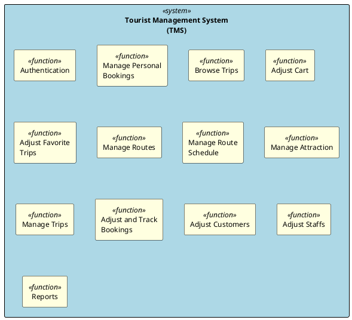

# Context Diagram

This context diagram shows the Tourist Management System (TMS) and its interactions with external actors through different functional functions.

<!-- diagram id="context-diagram-function-functions" -->

## Actors and Their Roles

### Customer

- **Primary Users**: Tourists who want to browse and book trips
- **Main Functions**:
  - Authentication (sign up, sign in, password management)
  - Browse and search available trips
  - Manage cart and favorite trips
  - Book trips and manage personal bookings
  - View and pay invoices

### Staff

- **Primary Users**: Company employees who assist customers and manage operations
- **Main Functions**:
  - Authentication (sign in, profile management)
  - View trip and route information
  - Process bookings for customers (add, view, edit, delete)
  - Manage customer accounts
  - View attraction and route details

### Admin

- **Primary Users**: System administrators with full access
- **Main Functions**:
  - All authentication features
  - Full CRUD operations on routes, attractions, and trips
  - Manage route schedules and itineraries
  - Manage both customer and staff accounts
  - View comprehensive system reports

### External Systems

- **Email System**: Sends confirmation emails, notifications, and password reset links
- **Payment Gateway**: Processes payments and verifies transactions

## Function function Descriptions

| Function function         | Actor(s)               | Use Cases | Description                                                                 |
| ------------------------- | ---------------------- | --------- | --------------------------------------------------------------------------- |
| Authentication            | Customer, Staff, Admin | 4         | User authentication, registration, password management, and profile updates |
| Manage Personal Bookings  | Customer, Staff        | 4         | Book trips, edit passenger details, view bookings, pay invoices             |
| Browse Trips              | Customer, Staff        | 2         | Search, filter, and view available trip details                             |
| Adjust Cart               | Customer               | 4         | Add/remove trips to/from cart, edit cart details, view cart                 |
| Adjust Favorite Trips     | Customer               | 3         | Mark trips as favorites, view favorite list                                 |
| Manage Routes             | Staff, Admin           | 5         | CRUD operations on tour routes                                              |
| Manage Route Schedule     | Staff, Admin           | 4         | Manage daily itineraries and attractions for routes                         |
| Manage Attraction         | Staff, Admin           | 5         | CRUD operations on tourist attractions                                      |
| Manage Trips              | Staff, Admin           | 6         | CRUD operations on trip instances, including booking creation               |
| Adjust and Track Bookings | Staff                  | 6         | Staff-side booking management and invoice viewing                           |
| Adjust Customers          | Staff, Admin           | 5         | CRUD operations on customer accounts                                        |
| Adjust Staffs             | Admin                  | 5         | CRUD operations on staff accounts                                           |
| Reports                   | Admin                  | 1         | View comprehensive system reports and analytics                             |

## System Boundaries

The Tourist Management System handles:

- User authentication and authorization
- Trip and route management
- Booking and payment processing
- Customer and staff account management
- Reporting and analytics

External dependencies:

- Email service for notifications
- Payment gateway for transaction processing
