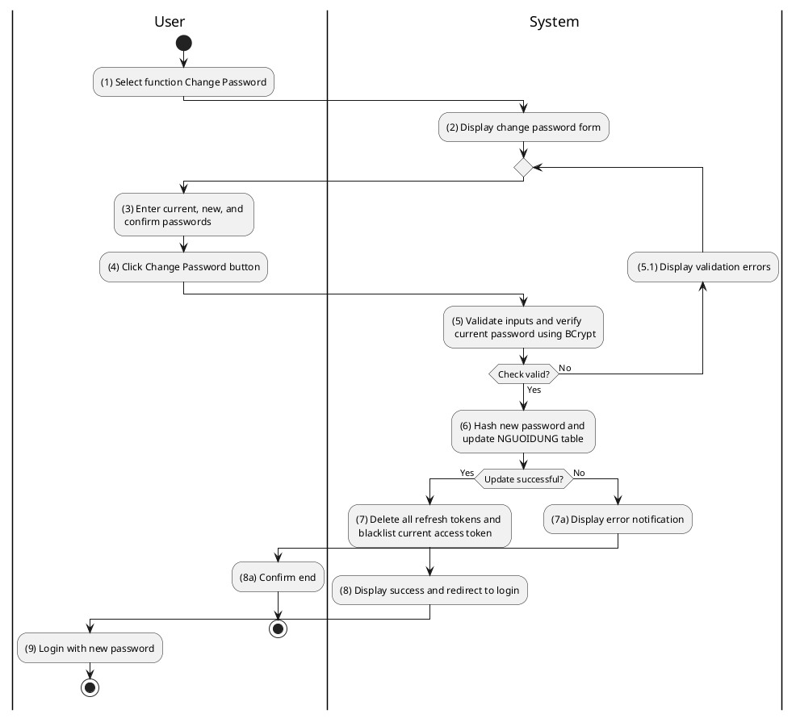

````markdown
# Activity Change Password


```plantuml
@startuml
|U|User
|Sys|System

|U|
start

:(1) Select function Change Password;

|Sys|
:(2) Display change password form;

repeat
	|U|
	:(3) Enter current, new, and \n confirm passwords;
	:(4) Click Change Password button;

	|Sys|
	:(5) Validate inputs and verify \n current password using BCrypt;
	backward: (5.1) Display validation errors;
repeat while (Check valid?) is (No) not (Yes)

|Sys|
:(6) Hash new password and \n update NGUOIDUNG table;

if (Update successful?) then (Yes)
	|Sys|
	:(7) Delete all refresh tokens and \n blacklist current access token;
	:(8) Display success and redirect to login;

	|U|
	:(9) Login with new password;

	stop
else (No)
	|Sys|
	:(7a) Display error notification;
	|U|
	:(8a) Confirm end;

	stop
endif

@enduml
```

<!-- diagram id="activity-auth-change-password" -->
````
