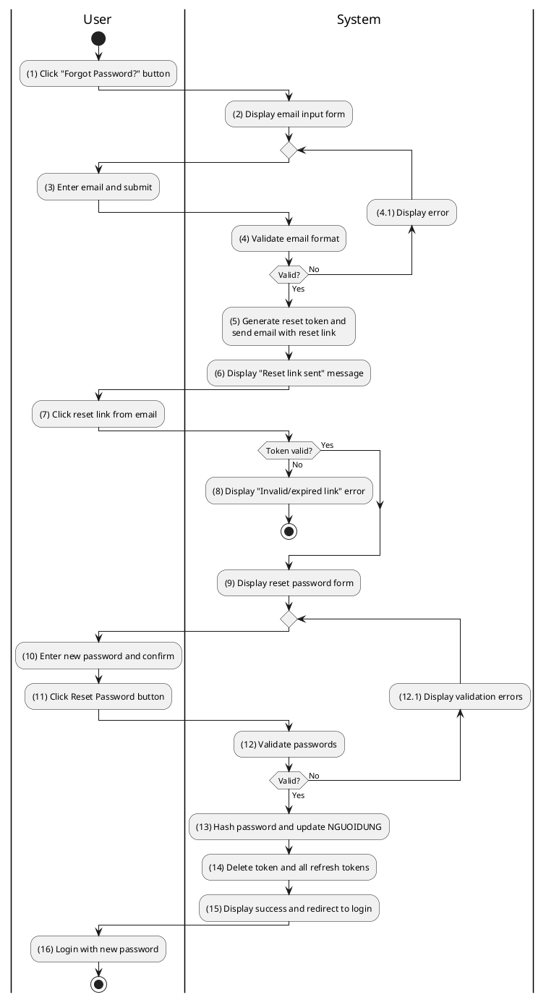

````markdown
# Activity Forgot Password


```plantuml
@startuml
|U|User
|Sys|System

|U|
start

:(1) Click "Forgot Password?" button;

|Sys|
:(2) Display email input form;

repeat
	|U|
	:(3) Enter email and submit;

	|Sys|
	:(4) Validate email format;
	backward: (4.1) Display error;
repeat while (Valid?) is (No) not (Yes)

|Sys|
:(5) Generate reset token and \n send email with reset link;
:(6) Display "Reset link sent" message;

|U|
:(7) Click reset link from email;

|Sys|
if (Token valid?) then (No)
	:(8) Display "Invalid/expired link" error;
	stop
else (Yes)
endif

|Sys|
:(9) Display reset password form;

repeat
	|U|
	:(10) Enter new password and confirm;
	:(11) Click Reset Password button;

	|Sys|
	:(12) Validate passwords;
	backward: (12.1) Display validation errors;
repeat while (Valid?) is (No) not (Yes)

|Sys|
:(13) Hash password and update NGUOIDUNG;
:(14) Delete token and all refresh tokens;
:(15) Display success and redirect to login;

|U|
:(16) Login with new password;

stop

@enduml
```

<!-- diagram id="activity-auth-forgot-password" -->
````
