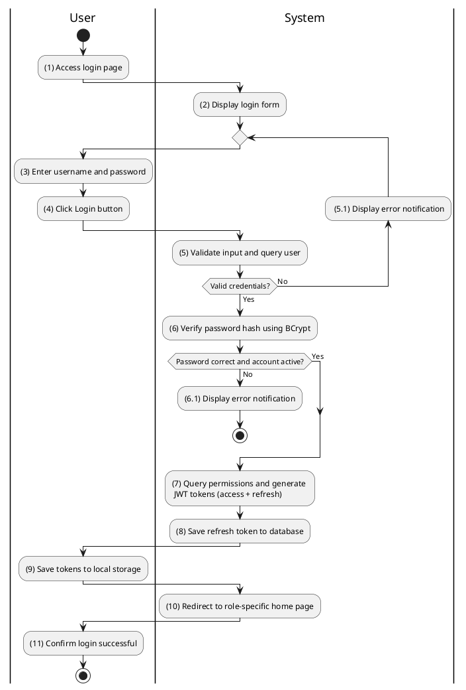

````markdown
# Activity Login


```plantuml
@startuml
|U|User
|Sys|System

|U|
start

:(1) Access login page;

|Sys|
:(2) Display login form;

repeat
	|U|
	:(3) Enter username and password;
	:(4) Click Login button;

	|Sys|
	:(5) Validate input and query user;
	backward: (5.1) Display error notification;
repeat while (Valid credentials?) is (No) not (Yes)

|Sys|
:(6) Verify password hash using BCrypt;

if (Password correct and account active?) then (No)
	:(6.1) Display error notification;
	stop
else (Yes)
endif

|Sys|
:(7) Query permissions and generate \n JWT tokens (access + refresh);
:(8) Save refresh token to database;

|U|
:(9) Save tokens to local storage;

|Sys|
:(10) Redirect to role-specific home page;

|U|
:(11) Confirm login successful;

stop

@enduml
```

<!-- diagram id="activity-auth-login" -->
````
