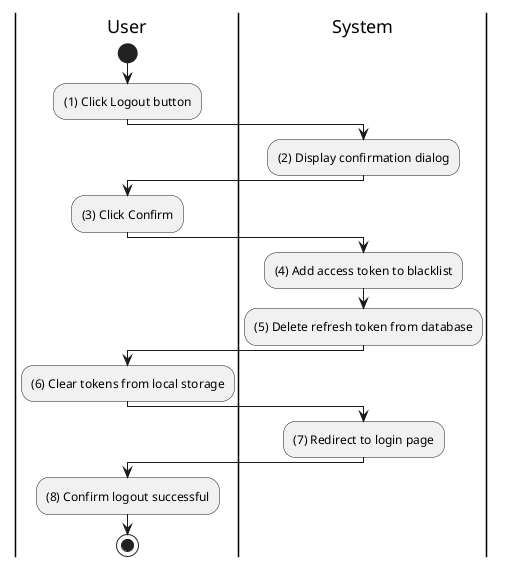

````markdown
# Activity Logout


```plantuml
@startuml
|U|User
|Sys|System

|U|
start

:(1) Click Logout button;

|Sys|
:(2) Display confirmation dialog;

|U|
:(3) Click Confirm;

|Sys|
:(4) Add access token to blacklist;
:(5) Delete refresh token from database;

|U|
:(6) Clear tokens from local storage;

|Sys|
:(7) Redirect to login page;

|U|
:(8) Confirm logout successful;

stop

@enduml
```

<!-- diagram id="activity-auth-logout" -->
````
