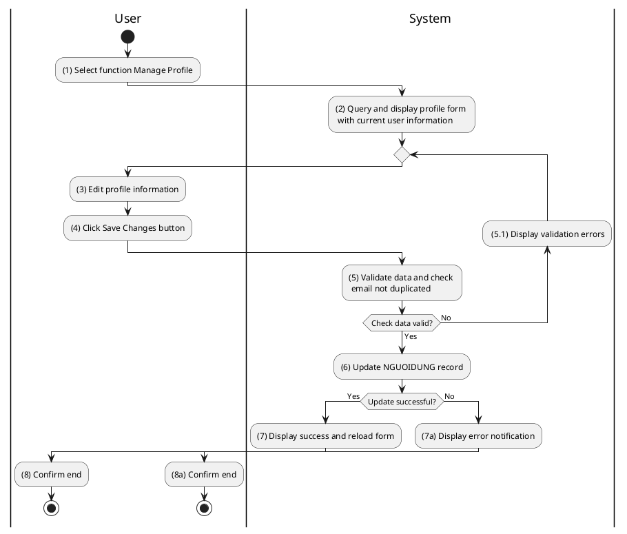

````markdown
# Activity Manage Profile


```plantuml
@startuml
|U|User
|Sys|System

|U|
start

:(1) Select function Manage Profile;

|Sys|
:(2) Query and display profile form \n with current user information;

repeat
	|U|
	:(3) Edit profile information;
	:(4) Click Save Changes button;

	|Sys|
	:(5) Validate data and check \n email not duplicated;
	backward: (5.1) Display validation errors;
repeat while (Check data valid?) is (No) not (Yes)

|Sys|
:(6) Update NGUOIDUNG record;

if (Update successful?) then (Yes)
	|Sys|
	:(7) Display success and reload form;

	|U|
	:(8) Confirm end;

	stop
else (No)
	|Sys|
	:(7a) Display error notification;
	|U|
	:(8a) Confirm end;

	stop
endif

@enduml
```

<!-- diagram id="activity-auth-manage-profile" -->
````
