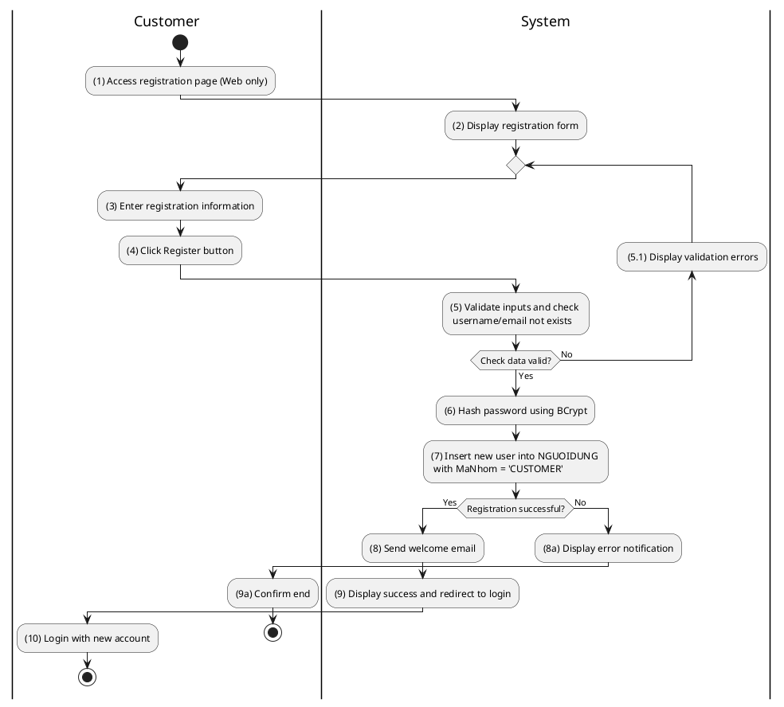

````markdown
# Activity Register Account


```plantuml
@startuml
|C|Customer
|Sys|System

|C|
start

:(1) Access registration page (Web only);

|Sys|
:(2) Display registration form;

repeat
	|C|
	:(3) Enter registration information;
	:(4) Click Register button;

	|Sys|
	:(5) Validate inputs and check \n username/email not exists;
	backward: (5.1) Display validation errors;
repeat while (Check data valid?) is (No) not (Yes)

|Sys|
:(6) Hash password using BCrypt;
:(7) Insert new user into NGUOIDUNG \n with MaNhom = 'CUSTOMER';

if (Registration successful?) then (Yes)
	|Sys|
	:(8) Send welcome email;
	:(9) Display success and redirect to login;

	|C|
	:(10) Login with new account;

	stop
else (No)
	|Sys|
	:(8a) Display error notification;
	|C|
	:(9a) Confirm end;

	stop
endif

@enduml
```

<!-- diagram id="activity-auth-register-account" -->
````
