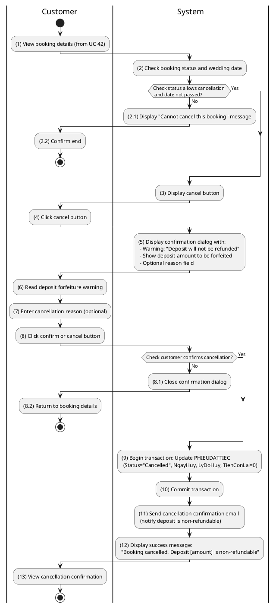

# Activity Cancel My Booking

```plantuml
@startuml
|C|Customer
|Sys|System

|C|
start

:(1) View booking details (from UC 42);

|Sys|
:(2) Check booking status and wedding date;

if (Check status allows cancellation \n and date not passed?) then (No)
	:(2.1) Display "Cannot cancel this booking" message;
	|C|
	:(2.2) Confirm end;
	stop
else (Yes)
endif

|Sys|
:(3) Display cancel button;

|C|
:(4) Click cancel button;

|Sys|
:(5) Display confirmation dialog with: \n - Warning: "Deposit will not be refunded" \n - Show deposit amount to be forfeited \n - Optional reason field;

|C|
:(6) Read deposit forfeiture warning;
:(7) Enter cancellation reason (optional);
:(8) Click confirm or cancel button;

|Sys|
if (Check customer confirms cancellation?) then (No)
	:(8.1) Close confirmation dialog;
	|C|
	:(8.2) Return to booking details;
	stop
else (Yes)
endif

|Sys|
:(9) Begin transaction: Update PHIEUDATTIEC \n (Status="Cancelled", NgayHuy, LyDoHuy, TienConLai=0);
:(10) Commit transaction;
:(11) Send cancellation confirmation email \n (notify deposit is non-refundable);
:(12) Display success message: \n "Booking cancelled. Deposit [amount] is non-refundable";

|C|
:(13) View cancellation confirmation;

stop

@enduml
```

<!-- diagram id="activity-customer-bookings-cancel-my-booking" -->
