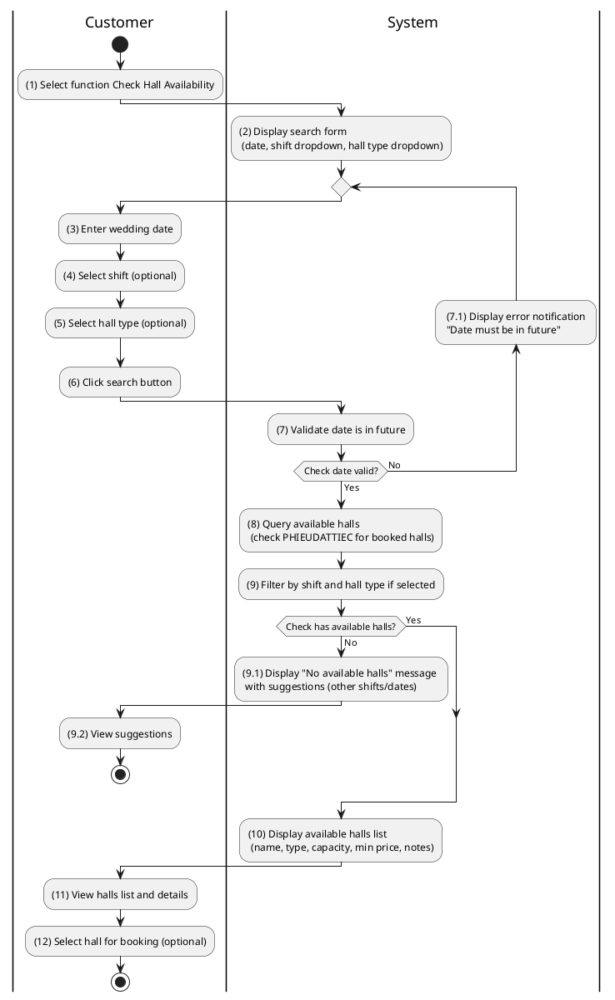

# Activity Check Hall Availability

```plantuml
@startuml
|C|Customer
|Sys|System

|C|
start

:(1) Select function Check Hall Availability;

|Sys|
:(2) Display search form \n (date, shift dropdown, hall type dropdown);

repeat
	|C|
	:(3) Enter wedding date;
	:(4) Select shift (optional);
	:(5) Select hall type (optional);
	:(6) Click search button;

	|Sys|
	:(7) Validate date is in future;
	backward: (7.1) Display error notification \n "Date must be in future";
repeat while (Check date valid?) is (No) not (Yes)

|Sys|
:(8) Query available halls \n (check PHIEUDATTIEC for booked halls);
:(9) Filter by shift and hall type if selected;

if (Check has available halls?) then (No)
	:(9.1) Display "No available halls" message \n with suggestions (other shifts/dates);
	|C|
	:(9.2) View suggestions;
	stop
else (Yes)
endif

|Sys|
:(10) Display available halls list \n (name, type, capacity, min price, notes);

|C|
:(11) View halls list and details;
:(12) Select hall for booking (optional);

stop

@enduml
```

<!-- diagram id="activity-customer-bookings-check-hall-availability" -->
