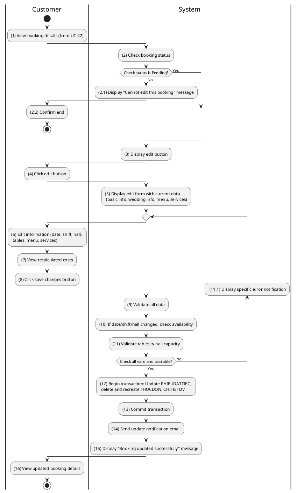

# Activity Edit My Booking Request

```plantuml
@startuml
|C|Customer
|Sys|System

|C|
start

:(1) View booking details (from UC 42);

|Sys|
:(2) Check booking status;

if (Check status is Pending?) then (No)
	:(2.1) Display "Cannot edit this booking" message;
	|C|
	:(2.2) Confirm end;
	stop
else (Yes)
endif

|Sys|
:(3) Display edit button;

|C|
:(4) Click edit button;

|Sys|
:(5) Display edit form with current data \n (basic info, wedding info, menu, services);

repeat
	|C|
	:(6) Edit information (date, shift, hall, \n tables, menu, services);
	:(7) View recalculated costs;
	:(8) Click save changes button;

	|Sys|
	:(9) Validate all data;
	:(10) If date/shift/hall changed, check availability;
	:(11) Validate tables ≤ hall capacity;
	backward: (11.1) Display specific error notification;
repeat while (Check all valid and available?) is (No) not (Yes)

|Sys|
:(12) Begin transaction: Update PHIEUDATTIEC, \n delete and recreate THUCDON, CHITIETDV;
:(13) Commit transaction;
:(14) Send update notification email;
:(15) Display "Booking updated successfully" message;

|C|
:(16) View updated booking details;

stop

@enduml
```

<!-- diagram id="activity-customer-bookings-edit-my-booking-request" -->
