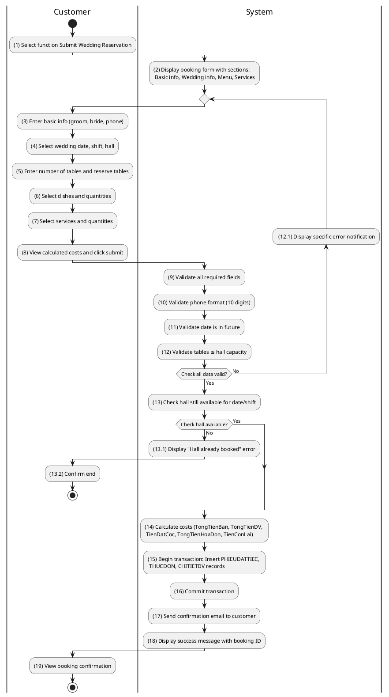

# Activity Submit Wedding Reservation

```plantuml
@startuml
|C|Customer
|Sys|System

|C|
start

:(1) Select function Submit Wedding Reservation;

|Sys|
:(2) Display booking form with sections: \n Basic info, Wedding info, Menu, Services;

repeat
	|C|
	:(3) Enter basic info (groom, bride, phone);
	:(4) Select wedding date, shift, hall;
	:(5) Enter number of tables and reserve tables;
	:(6) Select dishes and quantities;
	:(7) Select services and quantities;
	:(8) View calculated costs and click submit;

	|Sys|
	:(9) Validate all required fields;
	:(10) Validate phone format (10 digits);
	:(11) Validate date is in future;
	:(12) Validate tables ≤ hall capacity;
	backward: (12.1) Display specific error notification;
repeat while (Check all data valid?) is (No) not (Yes)

|Sys|
:(13) Check hall still available for date/shift;

if (Check hall available?) then (No)
	:(13.1) Display "Hall already booked" error;
	|C|
	:(13.2) Confirm end;
	stop
else (Yes)
endif

|Sys|
:(14) Calculate costs (TongTienBan, TongTienDV, \n TienDatCoc, TongTienHoaDon, TienConLai);
:(15) Begin transaction: Insert PHIEUDATTIEC, \n THUCDON, CHITIETDV records;
:(16) Commit transaction;
:(17) Send confirmation email to customer;
:(18) Display success message with booking ID;

|C|
:(19) View booking confirmation;

stop

@enduml
```

<!-- diagram id="activity-customer-bookings-submit-wedding-reservation" -->
