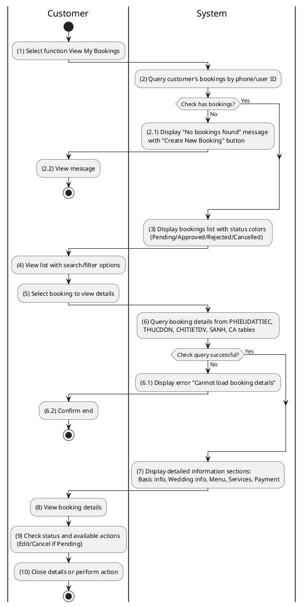

# Activity View My Booking Details

```plantuml
@startuml
|C|Customer
|Sys|System

|C|
start

:(1) Select function View My Bookings;

|Sys|
:(2) Query customer's bookings by phone/user ID;

if (Check has bookings?) then (No)
	:(2.1) Display "No bookings found" message \n with "Create New Booking" button;
	|C|
	:(2.2) View message;
	stop
else (Yes)
endif

|Sys|
:(3) Display bookings list with status colors \n (Pending/Approved/Rejected/Cancelled);

|C|
:(4) View list with search/filter options;
:(5) Select booking to view details;

|Sys|
:(6) Query booking details from PHIEUDATTIEC, \n THUCDON, CHITIETDV, SANH, CA tables;

if (Check query successful?) then (No)
	:(6.1) Display error "Cannot load booking details";
	|C|
	:(6.2) Confirm end;
	stop
else (Yes)
endif

|Sys|
:(7) Display detailed information sections: \n Basic info, Wedding info, Menu, Services, Payment;

|C|
:(8) View booking details;
:(9) Check status and available actions \n (Edit/Cancel if Pending);
:(10) Close details or perform action;

stop

@enduml
```

<!-- diagram id="activity-customer-bookings-view-my-booking-details" -->
