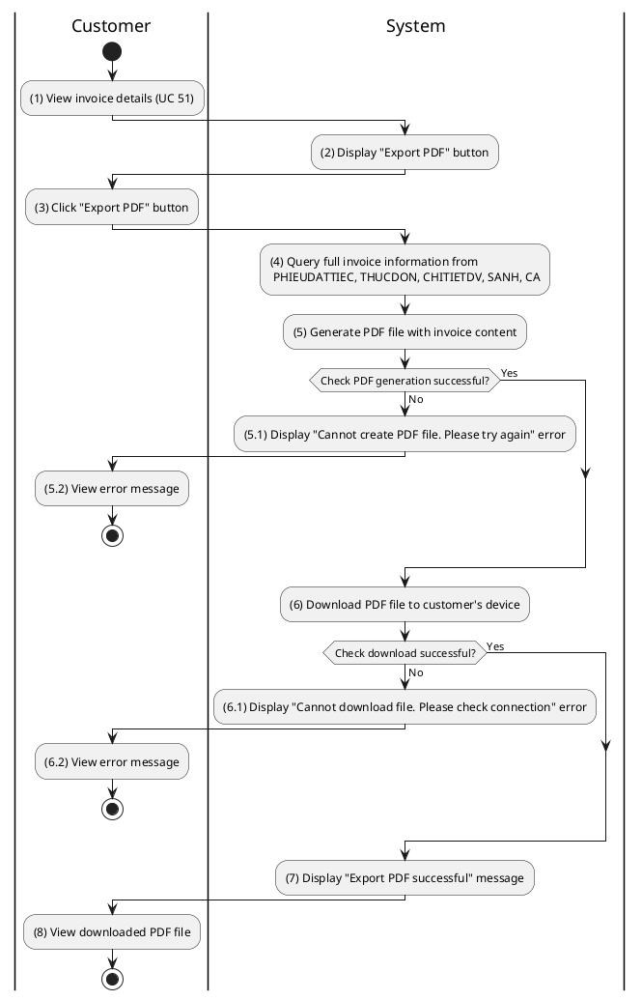

# Activity Export My Invoice to PDF

```plantuml
@startuml
|C|Customer
|Sys|System

|C|
start

:(1) View invoice details (UC 51);

|Sys|
:(2) Display "Export PDF" button;

|C|
:(3) Click "Export PDF" button;

|Sys|
:(4) Query full invoice information from \n PHIEUDATTIEC, THUCDON, CHITIETDV, SANH, CA;
:(5) Generate PDF file with invoice content;

if (Check PDF generation successful?) then (No)
	:(5.1) Display "Cannot create PDF file. Please try again" error;
	|C|
	:(5.2) View error message;
	stop
else (Yes)
endif

|Sys|
:(6) Download PDF file to customer's device;

if (Check download successful?) then (No)
	:(6.1) Display "Cannot download file. Please check connection" error;
	|C|
	:(6.2) View error message;
	stop
else (Yes)
endif

|Sys|
:(7) Display "Export PDF successful" message;

|C|
:(8) View downloaded PDF file;

stop

@enduml
```

<!-- diagram id="activity-customer-payment-export-my-invoice-to-pdf" -->
