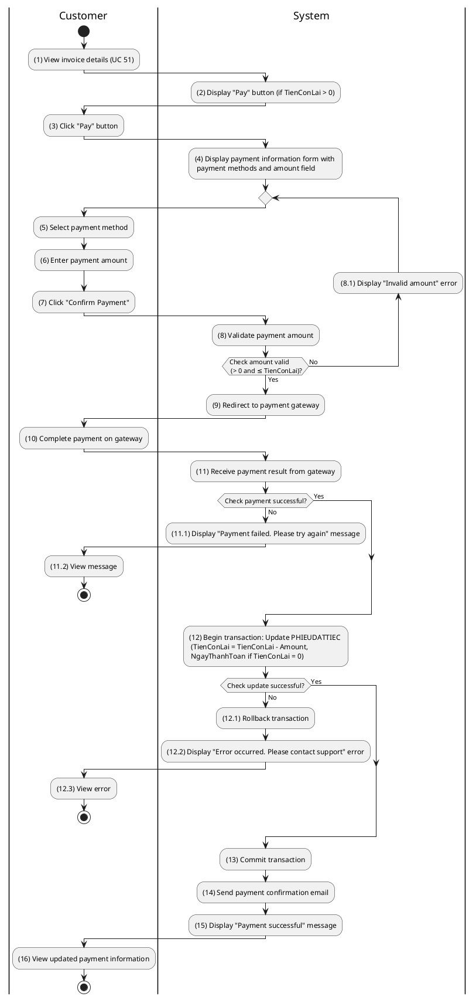

# Activity Pay My Invoice

```plantuml
@startuml
|C|Customer
|Sys|System

|C|
start

:(1) View invoice details (UC 51);

|Sys|
:(2) Display "Pay" button (if TienConLai > 0);

|C|
:(3) Click "Pay" button;

|Sys|
:(4) Display payment information form with \n payment methods and amount field;

repeat
	|C|
	:(5) Select payment method;
	:(6) Enter payment amount;
	:(7) Click "Confirm Payment";

	|Sys|
	:(8) Validate payment amount;
	backward: (8.1) Display "Invalid amount" error;
repeat while (Check amount valid \n (> 0 and ≤ TienConLai)?) is (No) not (Yes)

|Sys|
:(9) Redirect to payment gateway;

|C|
:(10) Complete payment on gateway;

|Sys|
:(11) Receive payment result from gateway;

if (Check payment successful?) then (No)
	:(11.1) Display "Payment failed. Please try again" message;
	|C|
	:(11.2) View message;
	stop
else (Yes)
endif

|Sys|
:(12) Begin transaction: Update PHIEUDATTIEC \n (TienConLai = TienConLai - Amount, \n NgayThanhToan if TienConLai = 0);

if (Check update successful?) then (No)
	:(12.1) Rollback transaction;
	:(12.2) Display "Error occurred. Please contact support" error;
	|C|
	:(12.3) View error;
	stop
else (Yes)
endif

|Sys|
:(13) Commit transaction;
:(14) Send payment confirmation email;
:(15) Display "Payment successful" message;

|C|
:(16) View updated payment information;

stop

@enduml
```

<!-- diagram id="activity-customer-payment-pay-my-invoice" -->
