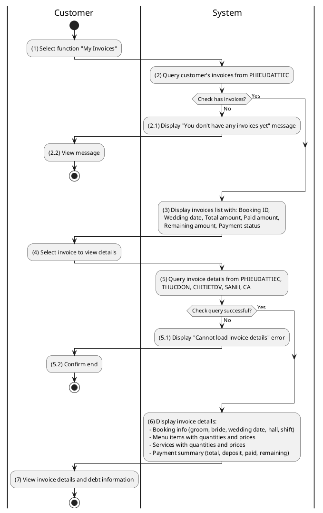

# Activity View My Invoice & Debt

```plantuml
@startuml
|C|Customer
|Sys|System

|C|
start

:(1) Select function "My Invoices";

|Sys|
:(2) Query customer's invoices from PHIEUDATTIEC;

if (Check has invoices?) then (No)
	:(2.1) Display "You don't have any invoices yet" message;
	|C|
	:(2.2) View message;
	stop
else (Yes)
endif

|Sys|
:(3) Display invoices list with: Booking ID, \n Wedding date, Total amount, Paid amount, \n Remaining amount, Payment status;

|C|
:(4) Select invoice to view details;

|Sys|
:(5) Query invoice details from PHIEUDATTIEC, \n THUCDON, CHITIETDV, SANH, CA;

if (Check query successful?) then (No)
	:(5.1) Display "Cannot load invoice details" error;
	|C|
	:(5.2) Confirm end;
	stop
else (Yes)
endif

|Sys|
:(6) Display invoice details: \n - Booking info (groom, bride, wedding date, hall, shift) \n - Menu items with quantities and prices \n - Services with quantities and prices \n - Payment summary (total, deposit, paid, remaining);

|C|
:(7) View invoice details and debt information;

stop

@enduml
```

<!-- diagram id="activity-customer-payment-view-my-invoice-and-debt" -->
