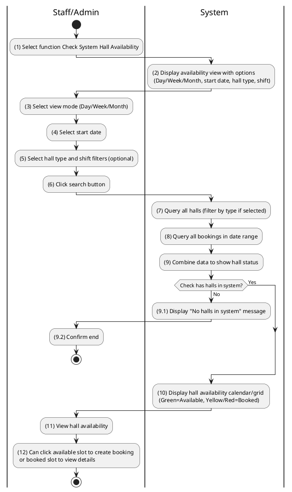

# Activity Check System Hall Availability

```plantuml
@startuml
|S|Staff/Admin
|Sys|System

|S|
start

:(1) Select function Check System Hall Availability;

|Sys|
:(2) Display availability view with options \n (Day/Week/Month, start date, hall type, shift);

|S|
:(3) Select view mode (Day/Week/Month);
:(4) Select start date;
:(5) Select hall type and shift filters (optional);
:(6) Click search button;

|Sys|
:(7) Query all halls (filter by type if selected);
:(8) Query all bookings in date range;
:(9) Combine data to show hall status;

if (Check has halls in system?) then (No)
	:(9.1) Display "No halls in system" message;
	|S|
	:(9.2) Confirm end;
	stop
else (Yes)
endif

|Sys|
:(10) Display hall availability calendar/grid \n (Green=Available, Yellow/Red=Booked);

|S|
:(11) View hall availability;
:(12) Can click available slot to create booking \n or booked slot to view details;

stop

@enduml
```

<!-- diagram id="activity-manage-bookings-check-system-hall-availability" -->
