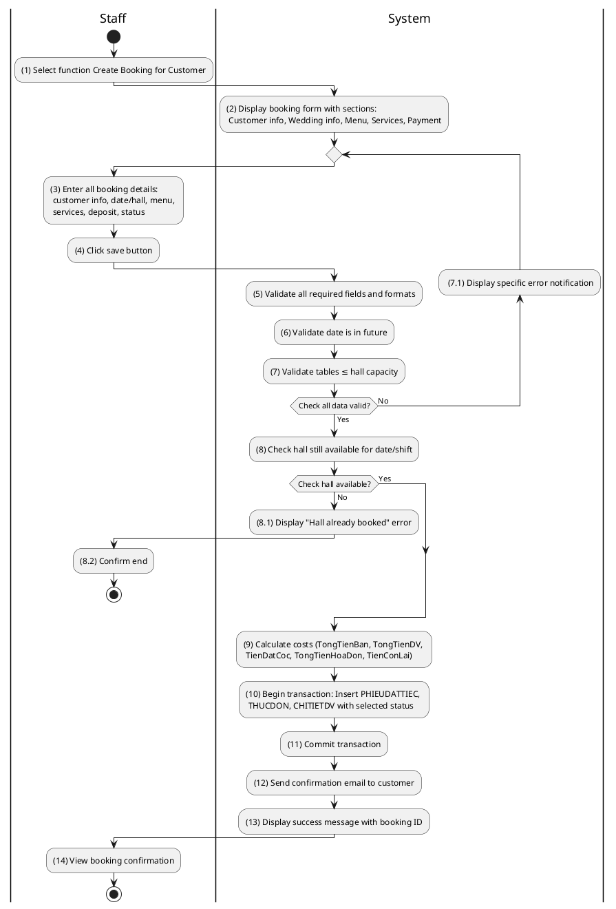

# Activity Create Booking for Customer

```plantuml
@startuml
|S|Staff
|Sys|System

|S|
start

:(1) Select function Create Booking for Customer;

|Sys|
:(2) Display booking form with sections: \n Customer info, Wedding info, Menu, Services, Payment;

repeat
	|S|
	:(3) Enter all booking details: \n customer info, date/hall, menu, \n services, deposit, status;
	:(4) Click save button;

	|Sys|
	:(5) Validate all required fields and formats;
	:(6) Validate date is in future;
	:(7) Validate tables ≤ hall capacity;
	backward: (7.1) Display specific error notification;
repeat while (Check all data valid?) is (No) not (Yes)

|Sys|
:(8) Check hall still available for date/shift;

if (Check hall available?) then (No)
	:(8.1) Display "Hall already booked" error;
	|S|
	:(8.2) Confirm end;
	stop
else (Yes)
endif

|Sys|
:(9) Calculate costs (TongTienBan, TongTienDV, \n TienDatCoc, TongTienHoaDon, TienConLai);
:(10) Begin transaction: Insert PHIEUDATTIEC, \n THUCDON, CHITIETDV with selected status;
:(11) Commit transaction;
:(12) Send confirmation email to customer;
:(13) Display success message with booking ID;

|S|
:(14) View booking confirmation;

stop

@enduml
```

<!-- diagram id="activity-manage-bookings-create-booking-for-customer" -->
