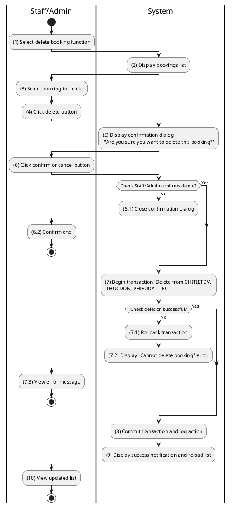

# Activity Delete Booking

```plantuml
@startuml
|S|Staff/Admin
|Sys|System

|S|
start

:(1) Select delete booking function;

|Sys|
:(2) Display bookings list;

|S|
:(3) Select booking to delete;
:(4) Click delete button;

|Sys|
:(5) Display confirmation dialog \n "Are you sure you want to delete this booking?";

|S|
:(6) Click confirm or cancel button;

|Sys|
if (Check Staff/Admin confirms delete?) then (No)
	:(6.1) Close confirmation dialog;
	|S|
	:(6.2) Confirm end;
	stop
else (Yes)
endif

|Sys|
:(7) Begin transaction: Delete from CHITIETDV, \n THUCDON, PHIEUDATTIEC;

if (Check deletion successful?) then (No)
	:(7.1) Rollback transaction;
	:(7.2) Display "Cannot delete booking" error;
	|S|
	:(7.3) View error message;
	stop
else (Yes)
endif

|Sys|
:(8) Commit transaction and log action;
:(9) Display success notification and reload list;

|S|
:(10) View updated list;

stop

@enduml
```

<!-- diagram id="activity-manage-bookings-delete-booking" -->
