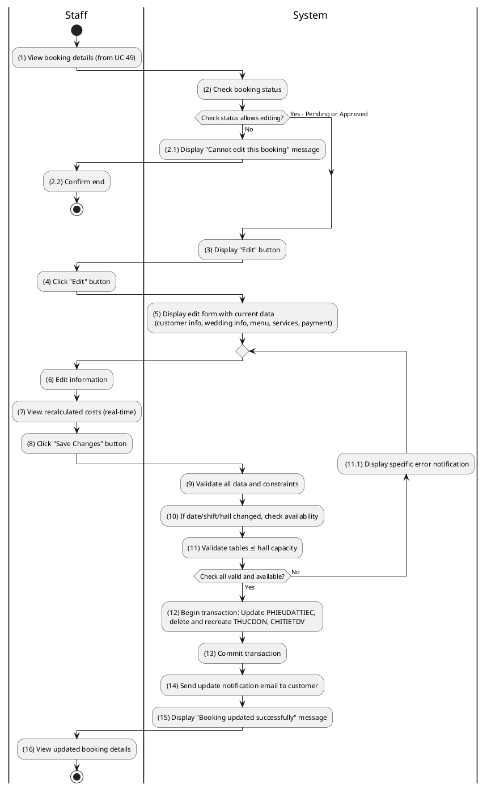

# Activity Modify Booking Details

```plantuml
@startuml
|S|Staff
|Sys|System

|S|
start

:(1) View booking details (from UC 49);

|Sys|
:(2) Check booking status;

if (Check status allows editing?) then (No)
	:(2.1) Display "Cannot edit this booking" message;
	|S|
	:(2.2) Confirm end;
	stop
else (Yes - Pending or Approved)
endif

|Sys|
:(3) Display "Edit" button;

|S|
:(4) Click "Edit" button;

|Sys|
:(5) Display edit form with current data \n (customer info, wedding info, menu, services, payment);

repeat
	|S|
	:(6) Edit information;
	:(7) View recalculated costs (real-time);
	:(8) Click "Save Changes" button;

	|Sys|
	:(9) Validate all data and constraints;
	:(10) If date/shift/hall changed, check availability;
	:(11) Validate tables ≤ hall capacity;
	backward: (11.1) Display specific error notification;
repeat while (Check all valid and available?) is (No) not (Yes)

|Sys|
:(12) Begin transaction: Update PHIEUDATTIEC, \n delete and recreate THUCDON, CHITIETDV;
:(13) Commit transaction;
:(14) Send update notification email to customer;
:(15) Display "Booking updated successfully" message;

|S|
:(16) View updated booking details;

stop

@enduml
```

<!-- diagram id="activity-manage-bookings-modify-booking-details" -->
