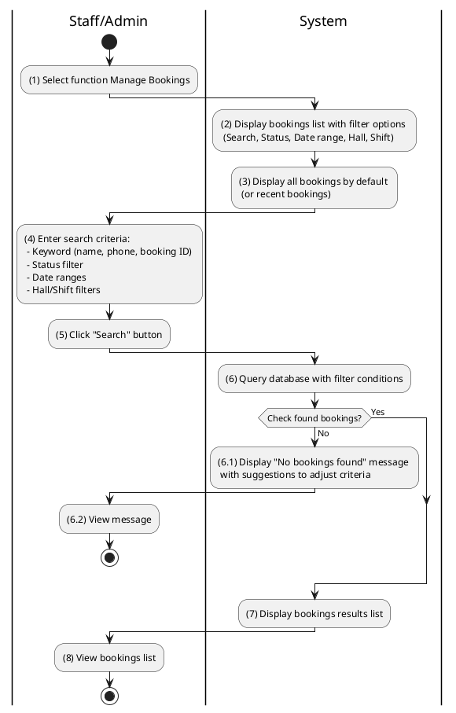

# Activity Search/Filter All Bookings

```plantuml
@startuml
|S|Staff/Admin
|Sys|System

|S|
start

:(1) Select function Manage Bookings;

|Sys|
:(2) Display bookings list with filter options \n (Search, Status, Date range, Hall, Shift);
:(3) Display all bookings by default \n (or recent bookings);

|S|
:(4) Enter search criteria: \n - Keyword (name, phone, booking ID) \n - Status filter \n - Date ranges \n - Hall/Shift filters;
:(5) Click "Search" button;

|Sys|
:(6) Query database with filter conditions;

if (Check found bookings?) then (No)
	:(6.1) Display "No bookings found" message \n with suggestions to adjust criteria;
	|S|
	:(6.2) View message;
	stop
else (Yes)
endif

|Sys|
:(7) Display bookings results list;

|S|
:(8) View bookings list;

stop

@enduml
```

<!-- diagram id="activity-manage-bookings-search-filter-all-bookings" -->
