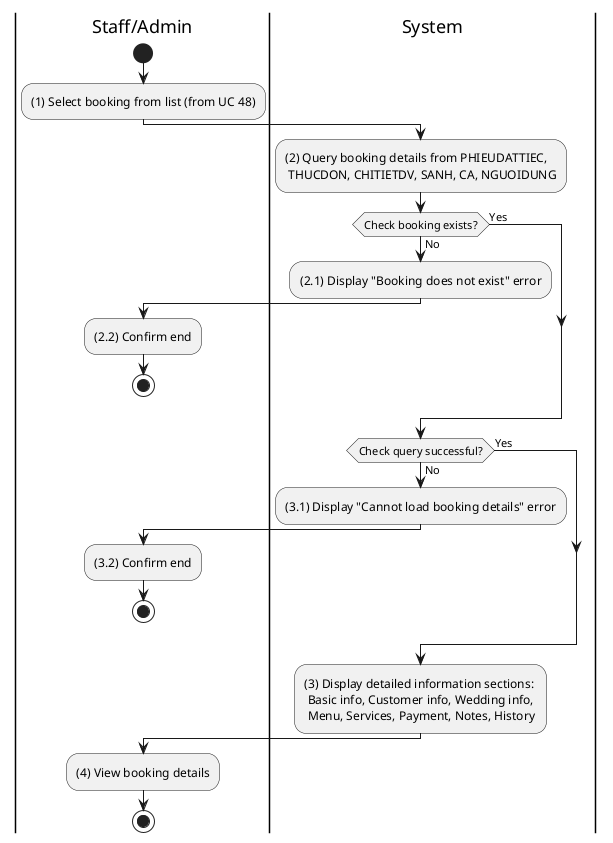

# Activity View Any Booking Details

```plantuml
@startuml
|S|Staff/Admin
|Sys|System

|S|
start

:(1) Select booking from list (from UC 48);

|Sys|
:(2) Query booking details from PHIEUDATTIEC, \n THUCDON, CHITIETDV, SANH, CA, NGUOIDUNG;

if (Check booking exists?) then (No)
	:(2.1) Display "Booking does not exist" error;
	|S|
	:(2.2) Confirm end;
	stop
else (Yes)
endif
|Sys|
if (Check query successful?) then (No)
	:(3.1) Display "Cannot load booking details" error;
	|S|
	:(3.2) Confirm end;
	stop
else (Yes)
endif

|Sys|
:(3) Display detailed information sections: \n Basic info, Customer info, Wedding info, \n Menu, Services, Payment, Notes, History;

|S|
:(4) View booking details;

stop

@enduml
```

<!-- diagram id="activity-manage-bookings-view-any-booking-details" -->
