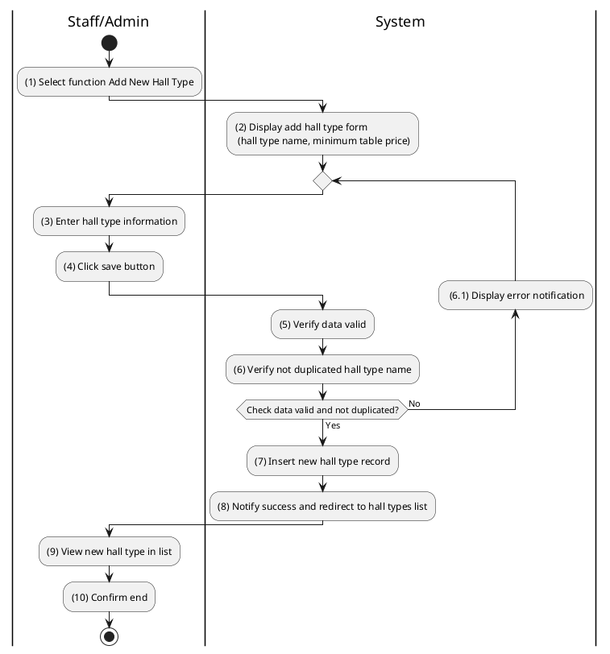

# Activity Add New Hall Type

```plantuml
@startuml
|S|Staff/Admin
|Sys|System

|S|
start

:(1) Select function Add New Hall Type;

|Sys|
:(2) Display add hall type form \n (hall type name, minimum table price);

repeat
	|S|
	:(3) Enter hall type information;
	:(4) Click save button;

	|Sys|
	:(5) Verify data valid;
	:(6) Verify not duplicated hall type name;
    backward: (6.1) Display error notification;
repeat while (Check data valid and not duplicated?) is (No) not (Yes)

|Sys|
:(7) Insert new hall type record;
:(8) Notify success and redirect to hall types list;

|S|
:(9) View new hall type in list;
:(10) Confirm end;

stop

@enduml
```

<!-- diagram id="activity-manage-hall-types-add-new-hall-type" -->
