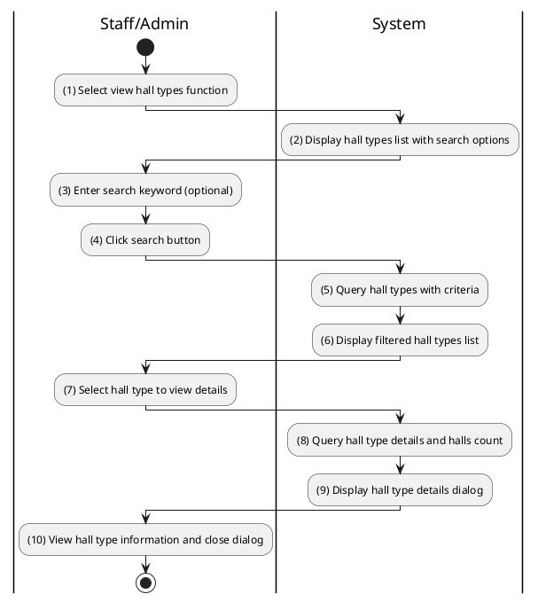

# Activity View Hall Type Details

```plantuml
@startuml
|S|Staff/Admin
|Sys|System

|S|
start

:(1) Select view hall types function;

|Sys|
:(2) Display hall types list with search options;

|S|
:(3) Enter search keyword (optional);
:(4) Click search button;

|Sys|
:(5) Query hall types with criteria;
:(6) Display filtered hall types list;

|S|
:(7) Select hall type to view details;

|Sys|
:(8) Query hall type details and halls count;
:(9) Display hall type details dialog;

|S|
:(10) View hall type information and close dialog;

stop

@enduml

<!-- diagram id="activity-manage-hall-types-view-hall-type-details" -->
```
