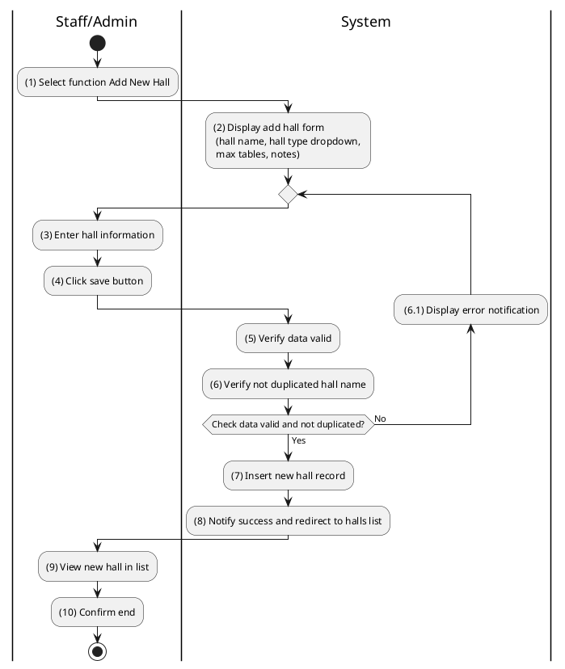

# Activity Add New Hall

```plantuml
@startuml
|S|Staff/Admin
|Sys|System

|S|
start

:(1) Select function Add New Hall;

|Sys|
:(2) Display add hall form \n (hall name, hall type dropdown, \n max tables, notes);

repeat
	|S|
	:(3) Enter hall information;
	:(4) Click save button;

	|Sys|
	:(5) Verify data valid;
	:(6) Verify not duplicated hall name;
    backward: (6.1) Display error notification;
repeat while (Check data valid and not duplicated?) is (No) not (Yes)

|Sys|
:(7) Insert new hall record;
:(8) Notify success and redirect to halls list;

|S|
:(9) View new hall in list;
:(10) Confirm end;

stop

@enduml
```

<!-- diagram id="activity-manage-halls-add-new-hall" -->
