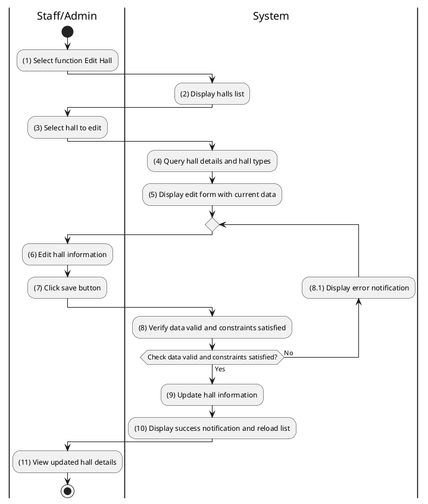

# Activity Edit Hall

```plantuml
@startuml
|S|Staff/Admin
|Sys|System

|S|
start

:(1) Select function Edit Hall;

|Sys|
:(2) Display halls list;

|S|
:(3) Select hall to edit;

|Sys|
:(4) Query hall details and hall types;
:(5) Display edit form with current data;

repeat
	|S|
	:(6) Edit hall information;
	:(7) Click save button;
	|Sys|
	:(8) Verify data valid and constraints satisfied;
    backward: (8.1) Display error notification;
repeat while (Check data valid and constraints satisfied?) is (No) not (Yes)

|Sys|
:(9) Update hall information;
:(10) Display success notification and reload list;

|S|
:(11) View updated hall details;

stop

@enduml
```

<!-- diagram id="activity-manage-halls-edit-hall" -->
