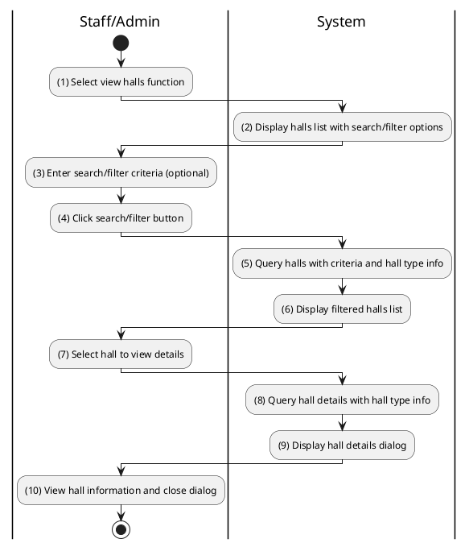

# Activity View Hall Details

```plantuml
@startuml
|S|Staff/Admin
|Sys|System

|S|
start

:(1) Select view halls function;

|Sys|
:(2) Display halls list with search/filter options;

|S|
:(3) Enter search/filter criteria (optional);
:(4) Click search/filter button;

|Sys|
:(5) Query halls with criteria and hall type info;
:(6) Display filtered halls list;

|S|
:(7) Select hall to view details;

|Sys|
:(8) Query hall details with hall type info;
:(9) Display hall details dialog;

|S|
:(10) View hall information and close dialog;

stop

@enduml

<!-- diagram id="activity-manage-halls-view-hall-details" -->
```
