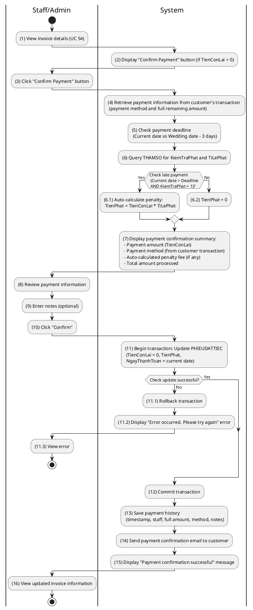

# Activity Confirm Payment & Calculate Penalty

```plantuml
@startuml
|S|Staff/Admin
|Sys|System

|S|
start

:(1) View invoice details (UC 54);

|Sys|
:(2) Display "Confirm Payment" button (if TienConLai > 0);

|S|
:(3) Click "Confirm Payment" button;

|Sys|
:(4) Retrieve payment information from customer's transaction \n (payment method and full remaining amount);
:(5) Check payment deadline \n (Current date vs Wedding date - 3 days);
:(6) Query THAMSO for KiemTraPhat and TiLePhat;

if (Check late payment \n (Current date > Deadline \n AND KiemTraPhat = 1)?) then (Yes)
	:(6.1) Auto-calculate penalty: \n TienPhat = TienConLai * TiLePhat;
else (No)
	:(6.2) TienPhat = 0;
endif

|Sys|
:(7) Display payment confirmation summary: \n - Payment amount (TienConLai) \n - Payment method (from customer transaction) \n - Auto-calculated penalty fee (if any) \n - Total amount processed;

|S|
:(8) Review payment information;
:(9) Enter notes (optional);
:(10) Click "Confirm";

|Sys|
:(11) Begin transaction: Update PHIEUDATTIEC \n (TienConLai = 0, TienPhat, \n NgayThanhToan = current date);

if (Check update successful?) then (No)
	:(11.1) Rollback transaction;
	:(11.2) Display "Error occurred. Please try again" error;
	|S|
	:(11.3) View error;
	stop
else (Yes)
endif

|Sys|
:(12) Commit transaction;
:(13) Save payment history \n (timestamp, staff, full amount, method, notes);
:(14) Send payment confirmation email to customer;
:(15) Display "Payment confirmation successful" message;

|S|
:(16) View updated invoice information;

stop

@enduml
```

<!-- diagram id="activity-manage-invoices-confirm-payment-and-calculate-penalty" -->
