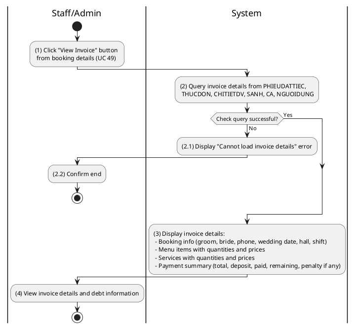

# Activity View Any Invoice & Debt

```plantuml
@startuml
|S|Staff/Admin
|Sys|System

|S|
start

:(1) Click "View Invoice" button \n from booking details (UC 49);

|Sys|
:(2) Query invoice details from PHIEUDATTIEC, \n THUCDON, CHITIETDV, SANH, CA, NGUOIDUNG;

if (Check query successful?) then (No)
	:(2.1) Display "Cannot load invoice details" error;
	|S|
	:(2.2) Confirm end;
	stop
else (Yes)
endif

|Sys|
:(3) Display invoice details: \n - Booking info (groom, bride, phone, wedding date, hall, shift) \n - Menu items with quantities and prices \n - Services with quantities and prices \n - Payment summary (total, deposit, paid, remaining, penalty if any);

|S|
:(4) View invoice details and debt information;

stop

@enduml
```

<!-- diagram id="activity-manage-invoices-view-any-invoice-and-debt" -->
