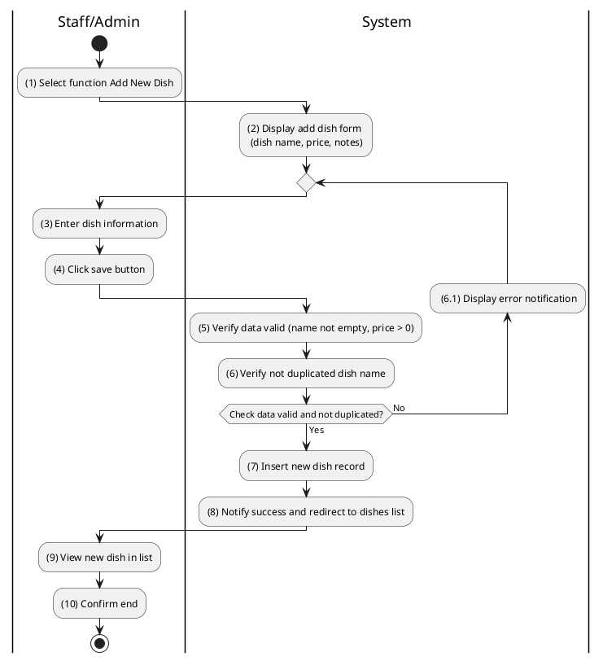

# Activity Add New Dish

```plantuml
@startuml
|S|Staff/Admin
|Sys|System

|S|
start

:(1) Select function Add New Dish;

|Sys|
:(2) Display add dish form \n (dish name, price, notes);

repeat
	|S|
	:(3) Enter dish information;
	:(4) Click save button;

	|Sys|
	:(5) Verify data valid (name not empty, price > 0);
	:(6) Verify not duplicated dish name;
    backward: (6.1) Display error notification;
repeat while (Check data valid and not duplicated?) is (No) not (Yes)

|Sys|
:(7) Insert new dish record;
:(8) Notify success and redirect to dishes list;

|S|
:(9) View new dish in list;
:(10) Confirm end;

stop

@enduml
```

<!-- diagram id="activity-manage-menu-add-new-dish" -->
