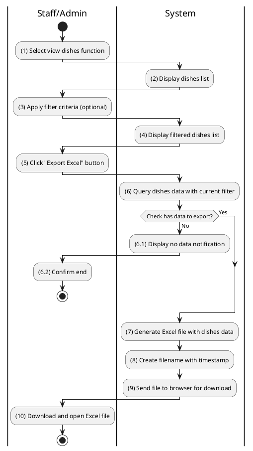

# Activity Export Dishes to Excel

```plantuml
@startuml
|S|Staff/Admin
|Sys|System

|S|
start

:(1) Select view dishes function;

|Sys|
:(2) Display dishes list;

|S|
:(3) Apply filter criteria (optional);

|Sys|
:(4) Display filtered dishes list;

|S|
:(5) Click "Export Excel" button;

|Sys|
:(6) Query dishes data with current filter;

if (Check has data to export?) then (No)
	:(6.1) Display no data notification;
	|S|
	:(6.2) Confirm end;
	stop
else (Yes)
endif

|Sys|
:(7) Generate Excel file with dishes data;
:(8) Create filename with timestamp;
:(9) Send file to browser for download;

|S|
:(10) Download and open Excel file;

stop

@enduml
```

<!-- diagram id="activity-manage-menu-export-dishes-to-excel" -->
