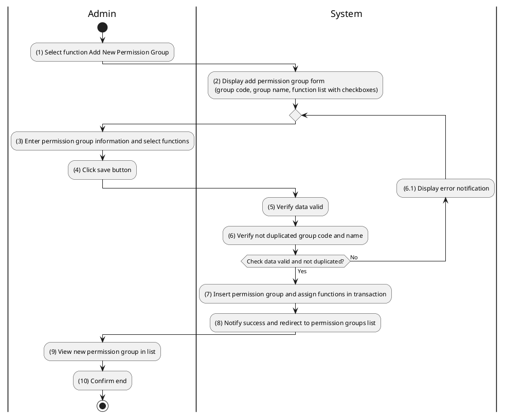

# Activity Add New Permission Group

```plantuml
@startuml
|A|Admin
|S|System

|A|
start

:(1) Select function Add New Permission Group;

|S|
:(2) Display add permission group form \n (group code, group name, function list with checkboxes);

repeat
	|A|
	:(3) Enter permission group information and select functions;
	:(4) Click save button;

	|S|
	:(5) Verify data valid;
	:(6) Verify not duplicated group code and name;
    backward: (6.1) Display error notification;
repeat while (Check data valid and not duplicated?) is (No) not (Yes)

|S|
:(7) Insert permission group and assign functions in transaction;
:(8) Notify success and redirect to permission groups list;

|A|
:(9) View new permission group in list;
:(10) Confirm end;

stop

@enduml
```

<!-- diagram id="activity-manage-permissions-add-new-permission-group" -->
