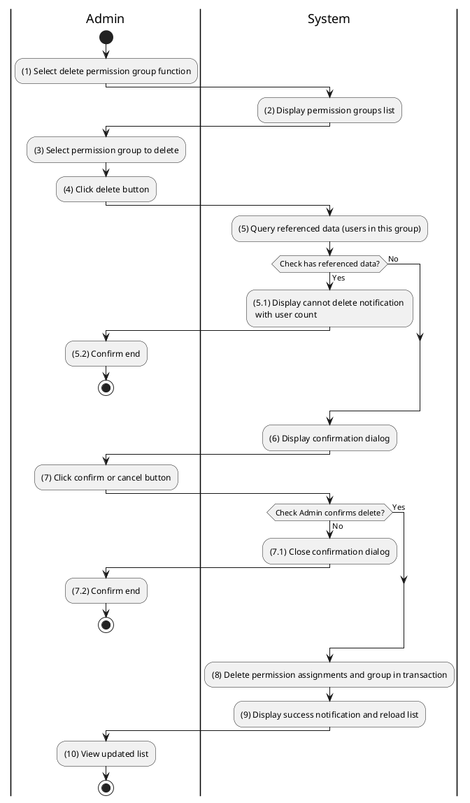

# Activity Delete Permission Group

```plantuml
@startuml
|A|Admin
|S|System

|A|
start

:(1) Select delete permission group function;

|S|
:(2) Display permission groups list;

|A|
:(3) Select permission group to delete;
:(4) Click delete button;

|S|
:(5) Query referenced data (users in this group);

if (Check has referenced data?) then (Yes)
	:(5.1) Display cannot delete notification \n with user count;
	|A|
	:(5.2) Confirm end;
	stop
else (No)
endif

|S|
:(6) Display confirmation dialog;

|A|
:(7) Click confirm or cancel button;

|S|
if (Check Admin confirms delete?) then (No)
	:(7.1) Close confirmation dialog;
	|A|
	:(7.2) Confirm end;
	stop
else (Yes)
endif

|S|
:(8) Delete permission assignments and group in transaction;
:(9) Display success notification and reload list;

|A|
:(10) View updated list;

stop

@enduml
```

<!-- diagram id="activity-manage-permissions-delete-permission-group" -->
