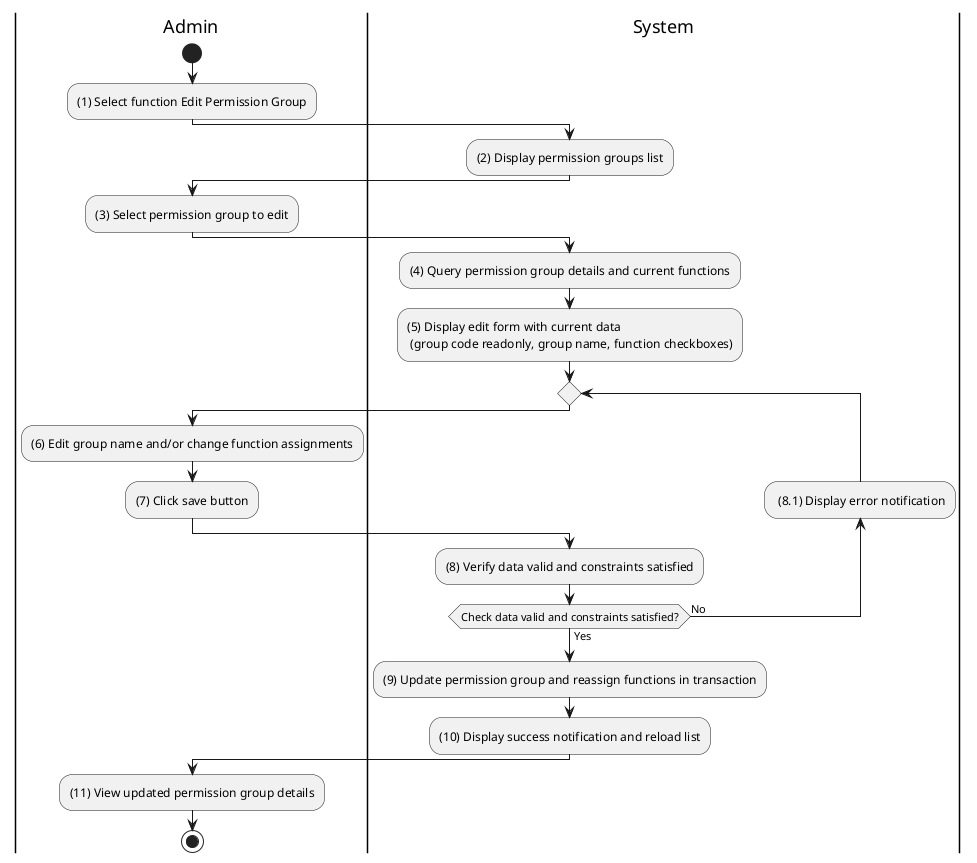

# Activity Edit Permission Group

```plantuml
@startuml
|A|Admin
|S|System

|A|
start

:(1) Select function Edit Permission Group;

|S|
:(2) Display permission groups list;

|A|
:(3) Select permission group to edit;

|S|
:(4) Query permission group details and current functions;
:(5) Display edit form with current data \n (group code readonly, group name, function checkboxes);

repeat
	|A|
	:(6) Edit group name and/or change function assignments;
	:(7) Click save button;
	|S|
	:(8) Verify data valid and constraints satisfied;
    backward: (8.1) Display error notification;
repeat while (Check data valid and constraints satisfied?) is (No) not (Yes)

|S|
:(9) Update permission group and reassign functions in transaction;
:(10) Display success notification and reload list;

|A|
:(11) View updated permission group details;

stop

@enduml
```

<!-- diagram id="activity-manage-permissions-edit-permission-group" -->
