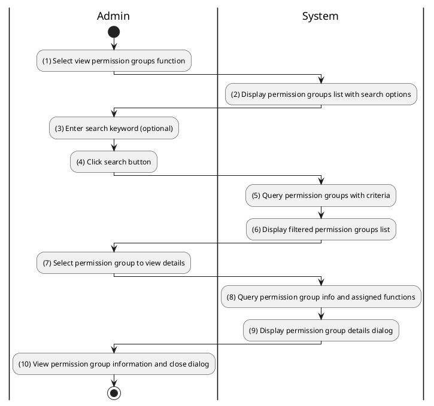

# Activity View Permission Group Details

```plantuml
@startuml
|A|Admin
|S|System

|A|
start

:(1) Select view permission groups function;

|S|
:(2) Display permission groups list with search options;

|A|
:(3) Enter search keyword (optional);
:(4) Click search button;

|S|
:(5) Query permission groups with criteria;
:(6) Display filtered permission groups list;

|A|
:(7) Select permission group to view details;

|S|
:(8) Query permission group info and assigned functions;
:(9) Display permission group details dialog;

|A|
:(10) View permission group information and close dialog;

stop

@enduml

<!-- diagram id="activity-manage-permissions-view-permission-group-details" -->
```
