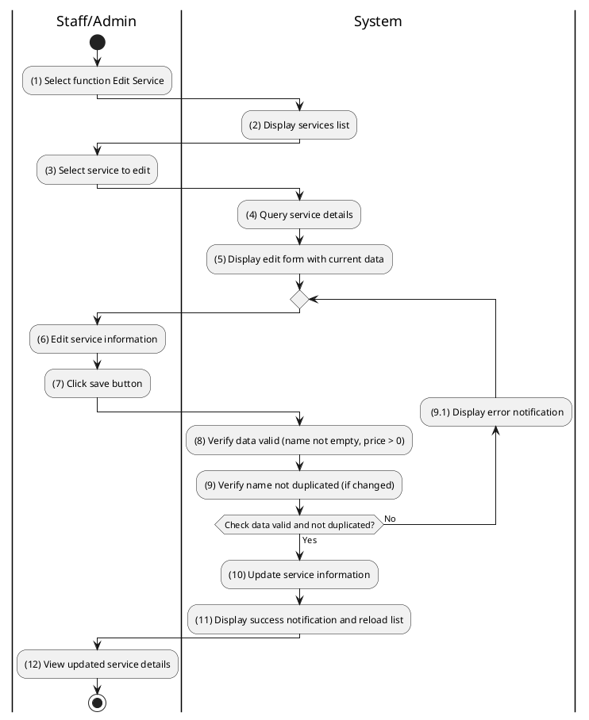

# Activity Edit Service

```plantuml
@startuml
|S|Staff/Admin
|Sys|System

|S|
start

:(1) Select function Edit Service;

|Sys|
:(2) Display services list;

|S|
:(3) Select service to edit;

|Sys|
:(4) Query service details;
:(5) Display edit form with current data;

repeat
	|S|
	:(6) Edit service information;
	:(7) Click save button;
	|Sys|
	:(8) Verify data valid (name not empty, price > 0);
	:(9) Verify name not duplicated (if changed);
    backward: (9.1) Display error notification;
repeat while (Check data valid and not duplicated?) is (No) not (Yes)

|Sys|
:(10) Update service information;
:(11) Display success notification and reload list;

|S|
:(12) View updated service details;

stop

@enduml
```

<!-- diagram id="activity-manage-services-edit-service" -->
