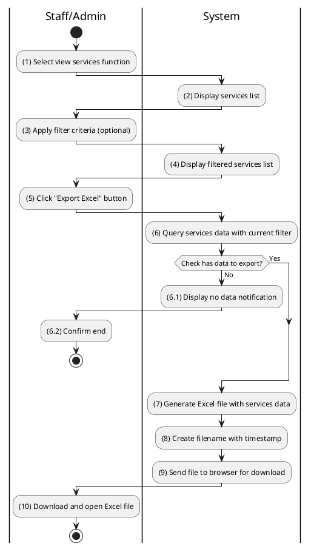

# Activity Export Services to Excel

```plantuml
@startuml
|S|Staff/Admin
|Sys|System

|S|
start

:(1) Select view services function;

|Sys|
:(2) Display services list;

|S|
:(3) Apply filter criteria (optional);

|Sys|
:(4) Display filtered services list;

|S|
:(5) Click "Export Excel" button;

|Sys|
:(6) Query services data with current filter;

if (Check has data to export?) then (No)
	:(6.1) Display no data notification;
	|S|
	:(6.2) Confirm end;
	stop
else (Yes)
endif

|Sys|
:(7) Generate Excel file with services data;
:(8) Create filename with timestamp;
:(9) Send file to browser for download;

|S|
:(10) Download and open Excel file;

stop

@enduml
```

<!-- diagram id="activity-manage-services-export-services-to-excel" -->
