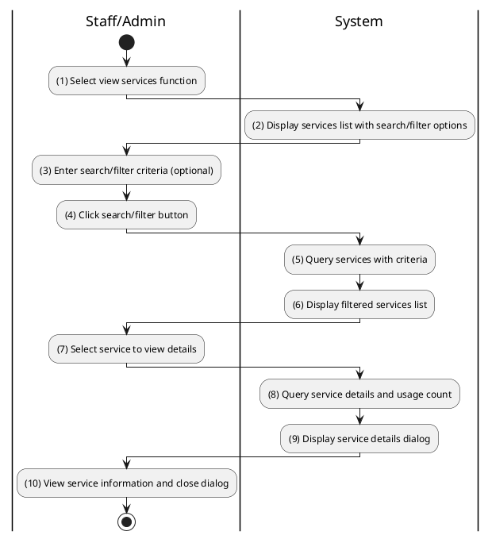

# Activity View Service Details

```plantuml
@startuml
|S|Staff/Admin
|Sys|System

|S|
start

:(1) Select view services function;

|Sys|
:(2) Display services list with search/filter options;

|S|
:(3) Enter search/filter criteria (optional);
:(4) Click search/filter button;

|Sys|
:(5) Query services with criteria;
:(6) Display filtered services list;

|S|
:(7) Select service to view details;

|Sys|
:(8) Query service details and usage count;
:(9) Display service details dialog;

|S|
:(10) View service information and close dialog;

stop

@enduml
```

<!-- diagram id="activity-manage-services-view-service-details" -->
