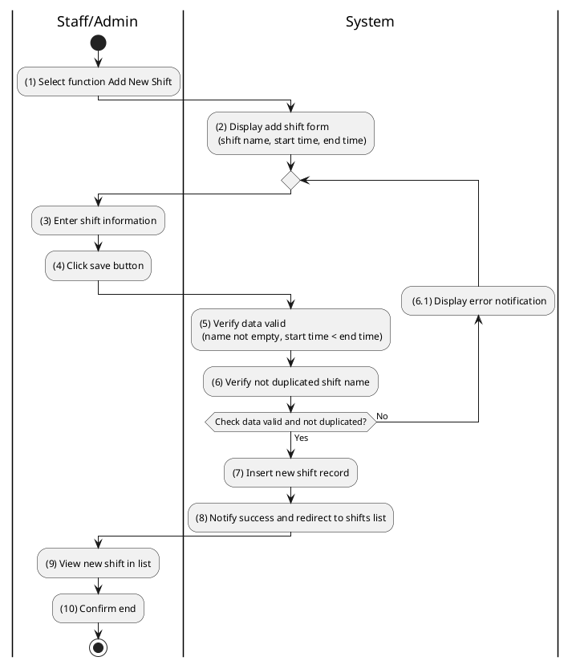

# Activity Add New Shift

```plantuml
@startuml
|S|Staff/Admin
|Sys|System

|S|
start

:(1) Select function Add New Shift;

|Sys|
:(2) Display add shift form \n (shift name, start time, end time);

repeat
	|S|
	:(3) Enter shift information;
	:(4) Click save button;

	|Sys|
	:(5) Verify data valid \n (name not empty, start time < end time);
	:(6) Verify not duplicated shift name;
    backward: (6.1) Display error notification;
repeat while (Check data valid and not duplicated?) is (No) not (Yes)

|Sys|
:(7) Insert new shift record;
:(8) Notify success and redirect to shifts list;

|S|
:(9) View new shift in list;
:(10) Confirm end;

stop

@enduml
```

<!-- diagram id="activity-manage-shifts-add-new-shift" -->
