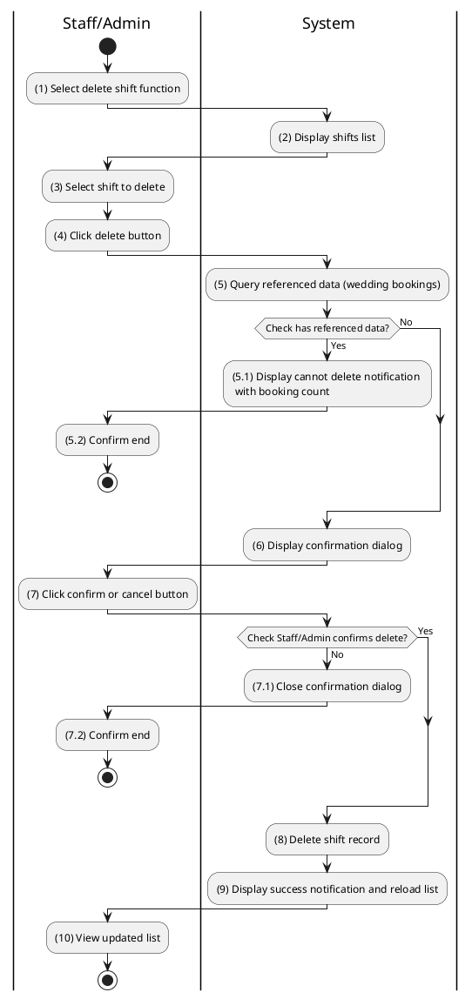

# Activity Delete Shift

```plantuml
@startuml
|S|Staff/Admin
|Sys|System

|S|
start

:(1) Select delete shift function;

|Sys|
:(2) Display shifts list;

|S|
:(3) Select shift to delete;
:(4) Click delete button;

|Sys|
:(5) Query referenced data (wedding bookings);

if (Check has referenced data?) then (Yes)
	:(5.1) Display cannot delete notification \n with booking count;
	|S|
	:(5.2) Confirm end;
	stop
else (No)
endif

|Sys|
:(6) Display confirmation dialog;

|S|
:(7) Click confirm or cancel button;

|Sys|
if (Check Staff/Admin confirms delete?) then (No)
	:(7.1) Close confirmation dialog;
	|S|
	:(7.2) Confirm end;
	stop
else (Yes)
endif

|Sys|
:(8) Delete shift record;
:(9) Display success notification and reload list;

|S|
:(10) View updated list;

stop

@enduml
```

<!-- diagram id="activity-manage-shifts-delete-shift" -->
