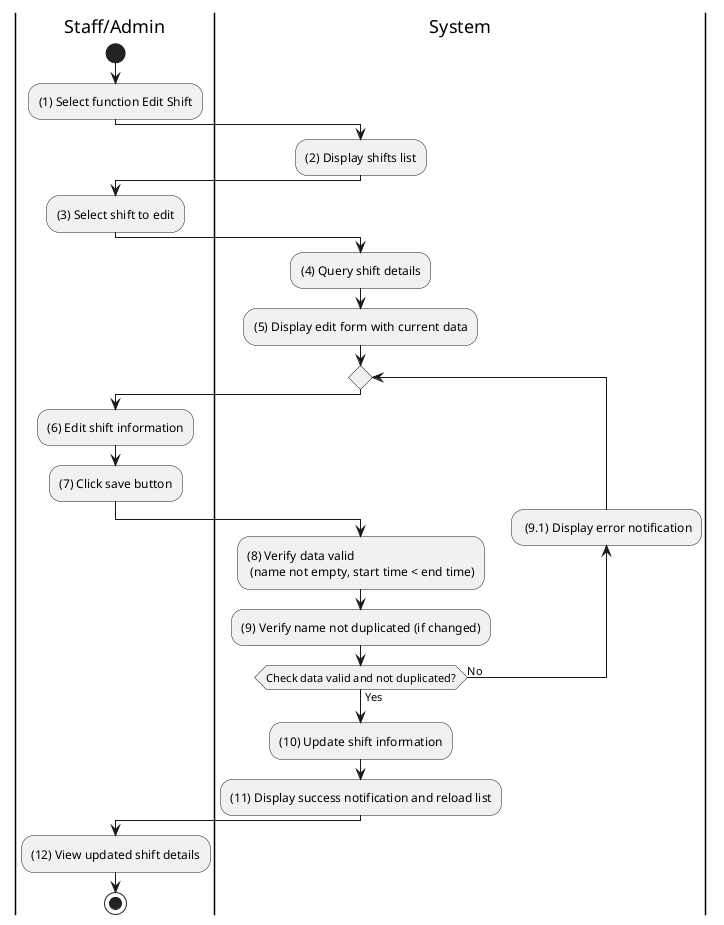

# Activity Edit Shift

```plantuml
@startuml
|S|Staff/Admin
|Sys|System

|S|
start

:(1) Select function Edit Shift;

|Sys|
:(2) Display shifts list;

|S|
:(3) Select shift to edit;

|Sys|
:(4) Query shift details;
:(5) Display edit form with current data;

repeat
	|S|
	:(6) Edit shift information;
	:(7) Click save button;
	|Sys|
	:(8) Verify data valid \n (name not empty, start time < end time);
	:(9) Verify name not duplicated (if changed);
    backward: (9.1) Display error notification;
repeat while (Check data valid and not duplicated?) is (No) not (Yes)

|Sys|
:(10) Update shift information;
:(11) Display success notification and reload list;

|S|
:(12) View updated shift details;

stop

@enduml
```

<!-- diagram id="activity-manage-shifts-edit-shift" -->
