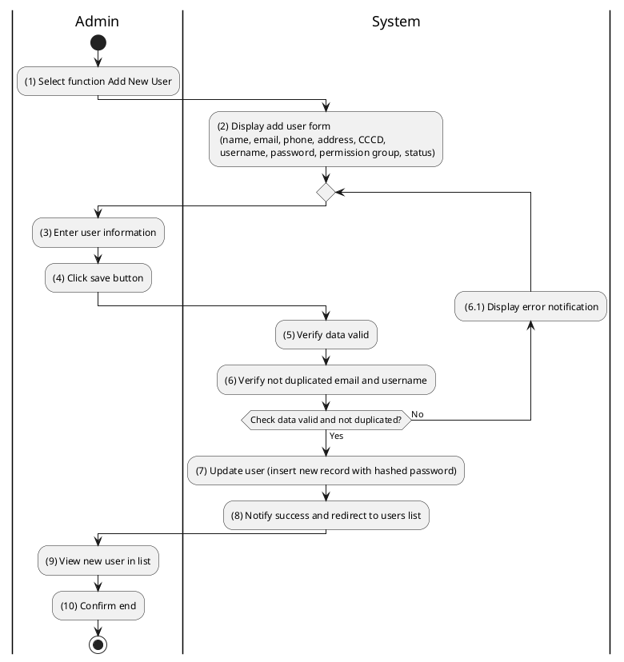

# Activity Add New User

```plantuml
@startuml
|A|Admin
|S|System

|A|
start

:(1) Select function Add New User;

|S|
:(2) Display add user form \n (name, email, phone, address, CCCD, \n username, password, permission group, status);

repeat
	|A|
	:(3) Enter user information;
	:(4) Click save button;

	|S|
	:(5) Verify data valid;
	:(6) Verify not duplicated email and username;
    backward: (6.1) Display error notification;
repeat while (Check data valid and not duplicated?) is (No) not (Yes)

|S|
:(7) Update user (insert new record with hashed password);
:(8) Notify success and redirect to users list;

|A|
:(9) View new user in list;
:(10) Confirm end;

stop

@enduml
```

<!-- diagram id="activity-manage-users-add-new-user" -->
