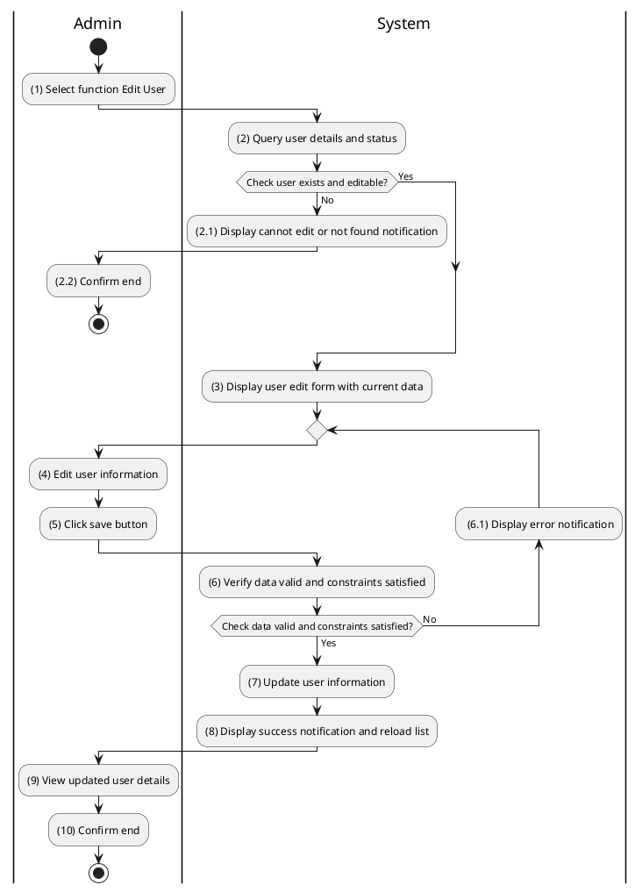

# Activity Edit User

```plantuml
@startuml
|A|Admin
|S|System

|A|
start

:(1) Select function Edit User;

|S|
:(2) Query user details and status;

if (Check user exists and editable?) then (No)
	:(2.1) Display cannot edit or not found notification;
	|A|
	:(2.2) Confirm end;
	stop
else (Yes)
endif

|S|
:(3) Display user edit form with current data;

repeat
	|A|
	:(4) Edit user information;
	:(5) Click save button;
	|S|
	:(6) Verify data valid and constraints satisfied;
    backward: (6.1) Display error notification;
repeat while (Check data valid and constraints satisfied?) is (No) not (Yes)

|S|
:(7) Update user information;
:(8) Display success notification and reload list;

|A|
:(9) View updated user details;
:(10) Confirm end;

stop

@enduml
```

<!-- diagram id="activity-manage-users-edit-user" -->
