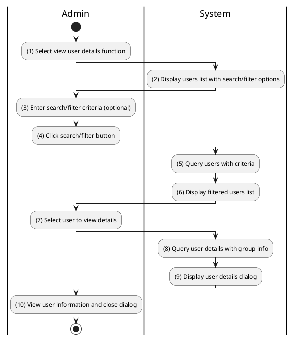

# Activity View User Details

```plantuml
@startuml
|A|Admin
|S|System

|A|
start

:(1) Select view user details function;

|S|
:(2) Display users list with search/filter options;

|A|
:(3) Enter search/filter criteria (optional);
:(4) Click search/filter button;

|S|
:(5) Query users with criteria;
:(6) Display filtered users list;

|A|
:(7) Select user to view details;

|S|
:(8) Query user details with group info;
:(9) Display user details dialog;

|A|
:(10) View user information and close dialog;

stop

@enduml

<!-- diagram id="activity-manage-users-view-user-details" -->
```
