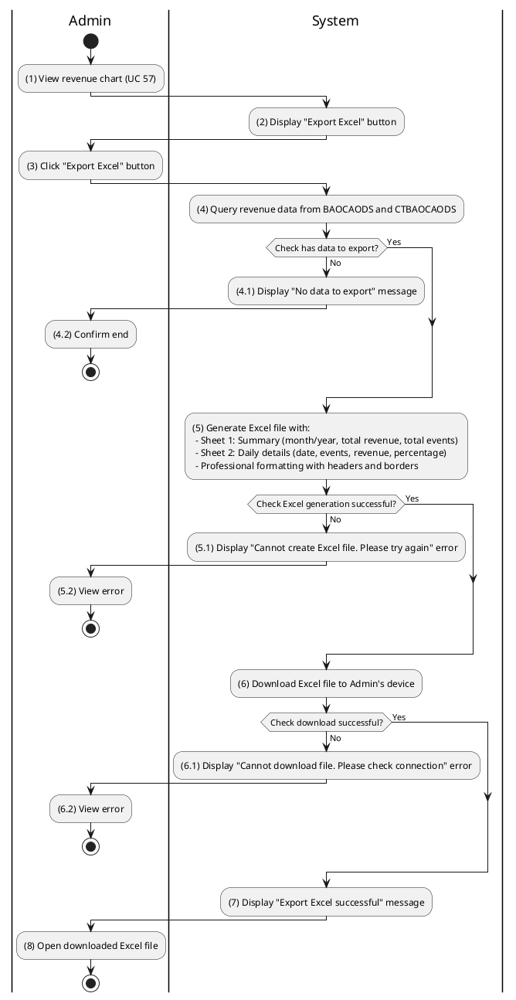

# Activity Export Report to Excel

```plantuml
@startuml
|A|Admin
|Sys|System

|A|
start

:(1) View revenue chart (UC 57);

|Sys|
:(2) Display "Export Excel" button;

|A|
:(3) Click "Export Excel" button;

|Sys|
:(4) Query revenue data from BAOCAODS and CTBAOCAODS;

if (Check has data to export?) then (No)
	:(4.1) Display "No data to export" message;
	|A|
	:(4.2) Confirm end;
	stop
else (Yes)
endif

|Sys|
:(5) Generate Excel file with: \n - Sheet 1: Summary (month/year, total revenue, total events) \n - Sheet 2: Daily details (date, events, revenue, percentage) \n - Professional formatting with headers and borders;

if (Check Excel generation successful?) then (No)
	:(5.1) Display "Cannot create Excel file. Please try again" error;
	|A|
	:(5.2) View error;
	stop
else (Yes)
endif

|Sys|
:(6) Download Excel file to Admin's device;

if (Check download successful?) then (No)
	:(6.1) Display "Cannot download file. Please check connection" error;
	|A|
	:(6.2) View error;
	stop
else (Yes)
endif

|Sys|
:(7) Display "Export Excel successful" message;

|A|
:(8) Open downloaded Excel file;

stop

@enduml
```

<!-- diagram id="activity-reporting-export-report-to-excel" -->
