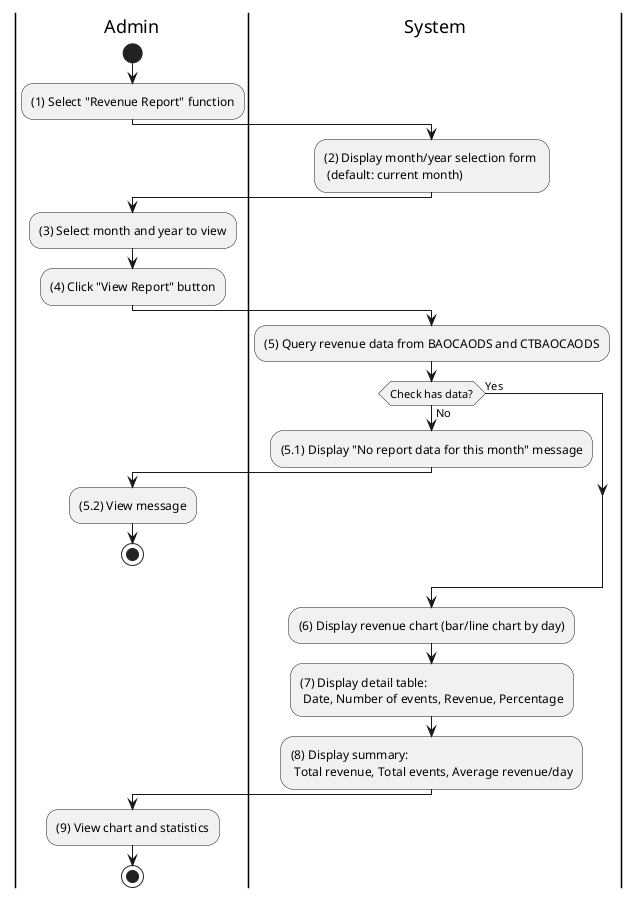

# Activity View Revenue Chart

```plantuml
@startuml
|A|Admin
|Sys|System

|A|
start

:(1) Select "Revenue Report" function;

|Sys|
:(2) Display month/year selection form \n (default: current month);

|A|
:(3) Select month and year to view;
:(4) Click "View Report" button;

|Sys|
:(5) Query revenue data from BAOCAODS and CTBAOCAODS;

if (Check has data?) then (No)
	:(5.1) Display "No report data for this month" message;
	|A|
	:(5.2) View message;
	stop
else (Yes)
endif

|Sys|
:(6) Display revenue chart (bar/line chart by day);
:(7) Display detail table: \n Date, Number of events, Revenue, Percentage;
:(8) Display summary: \n Total revenue, Total events, Average revenue/day;

|A|
:(9) View chart and statistics;

stop

@enduml
```

<!-- diagram id="activity-reporting-view-revenue-chart" -->
