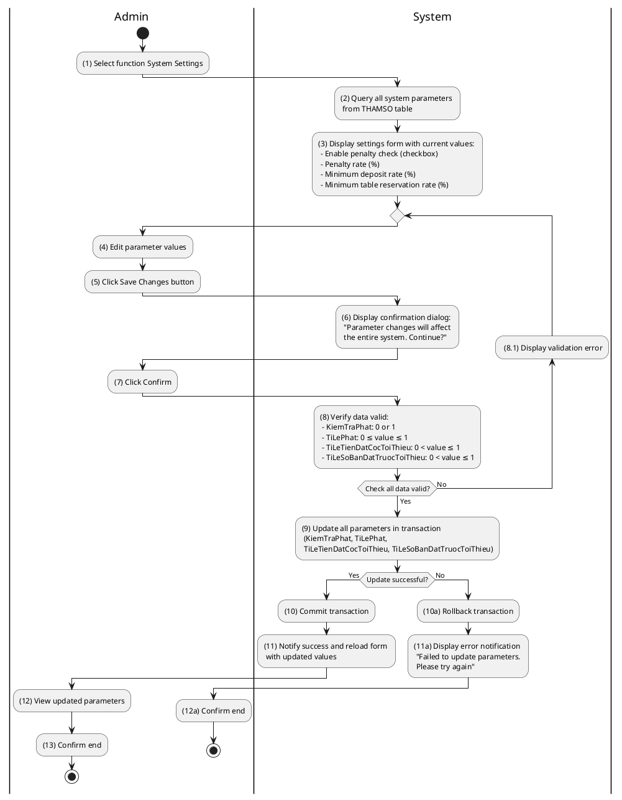

# Activity Manage System Parameters

```plantuml
@startuml
|A|Admin
|Sys|System

|A|
start

:(1) Select function System Settings;

|Sys|
:(2) Query all system parameters \n from THAMSO table;
:(3) Display settings form with current values: \n - Enable penalty check (checkbox) \n - Penalty rate (%) \n - Minimum deposit rate (%) \n - Minimum table reservation rate (%);

repeat
	|A|
	:(4) Edit parameter values;
	:(5) Click Save Changes button;

	|Sys|
	:(6) Display confirmation dialog: \n "Parameter changes will affect \n the entire system. Continue?";

	|A|
	:(7) Click Confirm;

	|Sys|
	:(8) Verify data valid: \n - KiemTraPhat: 0 or 1 \n - TiLePhat: 0 ≤ value ≤ 1 \n - TiLeTienDatCocToiThieu: 0 < value ≤ 1 \n - TiLeSoBanDatTruocToiThieu: 0 < value ≤ 1;
	backward: (8.1) Display validation error;
repeat while (Check all data valid?) is (No) not (Yes)

|Sys|
:(9) Update all parameters in transaction \n (KiemTraPhat, TiLePhat, \n TiLeTienDatCocToiThieu, TiLeSoBanDatTruocToiThieu);

if (Update successful?) then (Yes)
	|Sys|
	:(10) Commit transaction;
	:(11) Notify success and reload form \n with updated values;

	|A|
	:(12) View updated parameters;
	:(13) Confirm end;

	stop
else (No)
	|Sys|
	:(10a) Rollback transaction;
	:(11a) Display error notification \n "Failed to update parameters. \n Please try again";
    |A|
    :(12a) Confirm end;

	stop
endif

@enduml
```

<!-- diagram id="activity-system-settings-manage-system-parameters" -->
