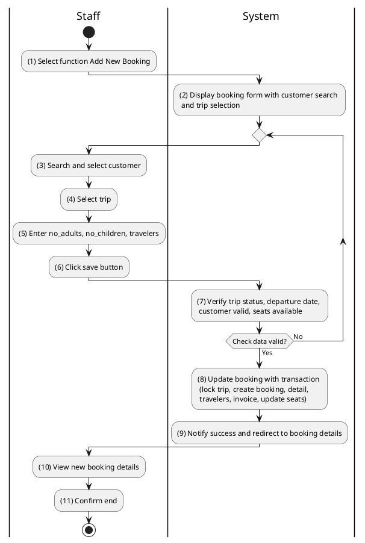

# Activity Add New Booking

```plantuml
@startuml
|St|Staff
|S|System

|St|
start
:(1) Select function Add New Booking;

|S|
:(2) Display booking form with customer search \n and trip selection;

repeat
  |St|
  :(3) Search and select customer;
  :(4) Select trip;
  :(5) Enter no_adults, no_children, travelers;
  :(6) Click save button;
  |S|
  :(7) Verify trip status, departure date, \n customer valid, seats available;
repeat while (Check data valid?) is (No) not (Yes)

|S|
:(8) Update booking with transaction \n (lock trip, create booking, detail, \n travelers, invoice, update seats);
:(9) Notify success and redirect to booking details;

|St|
:(10) View new booking details;
:(11) Confirm end;

stop

@enduml
```

<!-- diagram id="activity-adjust-and-track-bookings-add-new-booking" -->
