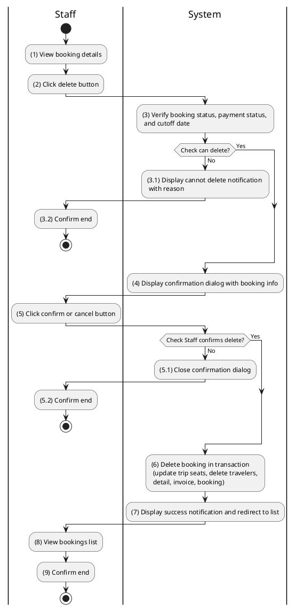

# Activity Delete Booking

```plantuml
@startuml
|St|Staff
|S|System

|St|
start

:(1) View booking details;
:(2) Click delete button;

|S|
:(3) Verify booking status, payment status, \n and cutoff date;

if (Check can delete?) then (No)
  :(3.1) Display cannot delete notification \n with reason;
  |St|
  :(3.2) Confirm end;
  stop
else (Yes)
endif

|S|
:(4) Display confirmation dialog with booking info;

|St|
:(5) Click confirm or cancel button;

|S|
if (Check Staff confirms delete?) then (No)
  :(5.1) Close confirmation dialog;
  |St|
  :(5.2) Confirm end;
  stop
else (Yes)
endif

|S|
:(6) Delete booking in transaction \n (update trip seats, delete travelers, \n detail, invoice, booking);
:(7) Display success notification and redirect to list;

|St|
:(8) View bookings list;
:(9) Confirm end;

stop

@enduml
```

<!-- diagram id="activity-adjust-and-track-bookings-delete-booking" -->
