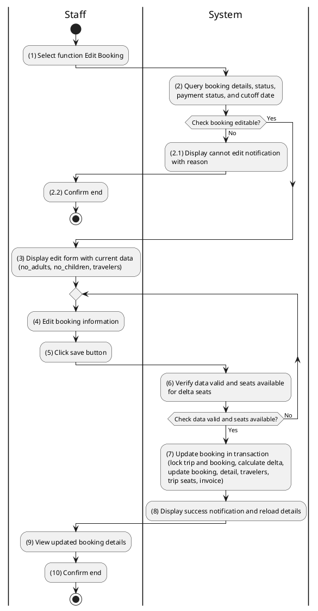

# Activity Edit Pre-departure Booking

```plantuml
@startuml
|St|Staff
|S|System

|St|
start

:(1) Select function Edit Booking;

|S|
:(2) Query booking details, status, \n payment status, and cutoff date;

if (Check booking editable?) then (No)
  :(2.1) Display cannot edit notification \n with reason;
  |St|
  :(2.2) Confirm end;
  stop
else (Yes)
endif

:(3) Display edit form with current data \n (no_adults, no_children, travelers);

repeat
  |St|
  :(4) Edit booking information;
  :(5) Click save button;
  |S|
  :(6) Verify data valid and seats available \n for delta seats;
repeat while (Check data valid and seats available?) is (No) not (Yes)

|S|
:(7) Update booking in transaction \n (lock trip and booking, calculate delta, \n update booking, detail, travelers, \n trip seats, invoice);
:(8) Display success notification and reload details;

|St|
:(9) View updated booking details;
:(10) Confirm end;

stop

@enduml
```

<!-- diagram id="activity-adjust-and-track-bookings-edit-pre-departure-booking" -->
