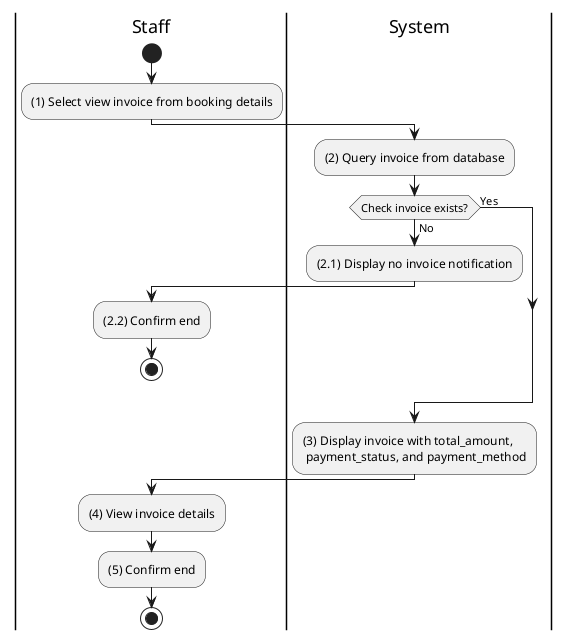

# Activity View Booking's Invoice

```plantuml
@startuml
|St|Staff
|S|System

|St|
start

:(1) Select view invoice from booking details;

|S|
:(2) Query invoice from database;

if (Check invoice exists?) then (No)
  :(2.1) Display no invoice notification;
  |St|
  :(2.2) Confirm end;
  stop
else (Yes)
endif

|S|
:(3) Display invoice with total_amount, \n payment_status, and payment_method;

|St|
:(4) View invoice details;
:(5) Confirm end;

stop

@enduml
```

<!-- diagram id="activity-adjust-and-track-bookings-view-booking's-invoice" -->
